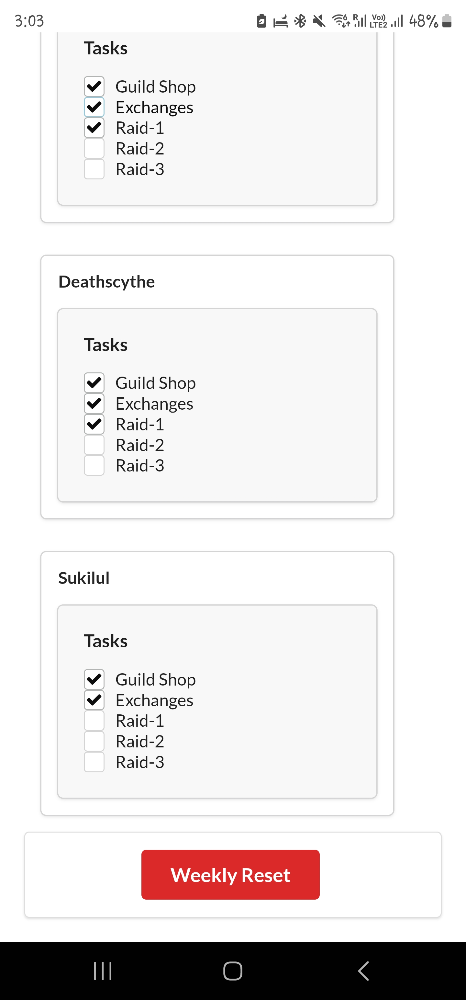

### Lost Ark Check List 
This web app allows users to manage and track task completion for multiple characters in a game. Each character has a list of tasks (e.g., Guild Shop, Raids, Exchanges), and users can toggle the completion status of each task. The state of each character’s tasks is saved to localStorage, so the task completion state persists across page reloads. A button allows users to reset all tasks to "not completed" with a confirmation prompt.

 
 

